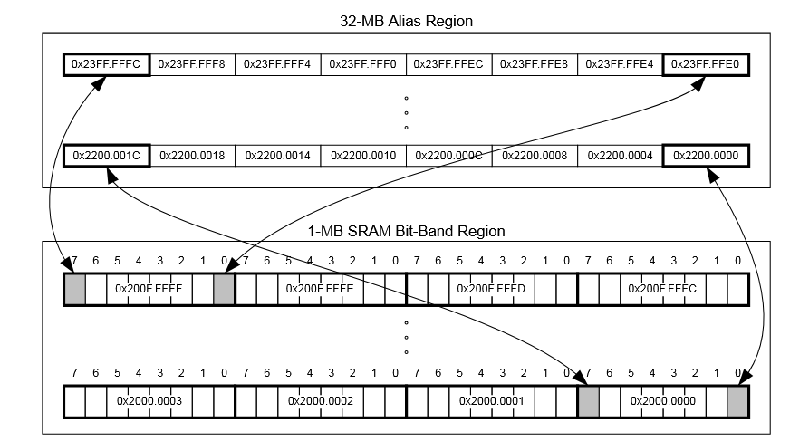

# Is Bit-Banding Worth It?

## An Experimental Comparison of Bit-Banding vs Read-Modify-Write (RMW) on the TM4C123GXL

**Quick Navigation**  
[Abstract](#abstract) | [Docs Home](docs/README.md) | [Methods](docs/methodology/overview.md) | [Experiments](docs/tests/README.md) | [Results](docs/results/README.md) | [Glossary](docs/glossary.md) | [References](docs/references.md)

### Abstract

Bit-banding is often described as a fast way to manipulate single bits on ARM Cortex-M microcontrollers, but its real value depends on trade-offs. This project experimentally compares bit-banding and Read-Modify-Write (RMW) on a TM4C123GXL (Cortex-M4) using repeatable benchmarks. We evaluate cycle cost, code size, and atomicity under interrupts to provide practical guidance for embedded developers.

  

## Motivation

Embedded software frequently needs reliable bit updates, such as GPIO control and status flags. RMW is simple and flexible, but can be non-atomic when interrupts touch the same word. Bit-banding provides atomic single-bit set and clear via alias addresses, but has limitations such as no native toggle and reduced portability. This repo measures these trade-offs on real hardware.

## What We Measure

- Speed: raw cycle counts using the SysTick down-counter
- Code size: .text size extracted from the linker .map file
- Atomicity: interrupt contention tests designed to expose race conditions

## Key Findings

- For single-bit set and clear operations, bit-banding is typically similar in speed to RMW on the TM4C123GXL.
- RMW has a native toggle operation, while bit-banding must emulate toggling using set and clear.
- Bit-banding provides atomic single-bit updates, reducing race risk when an ISR and main code contend on the same word.
- Bit-banding is a poor fit for multi-bit writes, since a full word update becomes many single-bit stores and can be dramatically slower.

## Team

Project Lead: Subhaan

Team: Ali, Hadi, Jose, Skand

## Repo Map

- Docs home: [docs/README.md](docs/README.md)
- Methodology: [docs/methodology/overview.md](docs/methodology/overview.md)
- Tests index: [docs/tests/README.md](docs/tests/README.md)
- Results summary: [docs/results/README.md](docs/results/README.md)
- References: [docs/references.md](docs/references.md)

Source code:

- CCS projects: `ccs_projects/` (one folder per test program)

## How to Reproduce

1. Follow the setup guide: [docs/setup/ccs-import.md](docs/setup/ccs-import.md)
2. Import a project into CCS and build/flash to the TM4C123GXL
3. Run the test, stop at the breakpoint after the loop, and record:
   - start_ticks, end_ticks, ticks
   - .text size from the .map file
4. Add the data to your results tables and compare against the summary in docs/results

## Acknowledgments

We would like to thank the ACM Research Committee at UTA for facilitating this project and providing a platform for our research.

Special thanks to the ACM Research Committee leads, Mariah Gardner and Rohita Konjeti for their guidance and mentorship through the project.

Additionally, we would like to extend our gratitude to Professor Jimmie Bud Davis for generously providing the TM4C microcontroller boards used in our experiments.

  
  &nbsp; &nbsp; 

## References

See [docs/references.md](docs/references.md) for datasheets, ARM documentation, and related material.

## License

This project is licensed under the MIT License. See [LICENSE](LICENSE).
