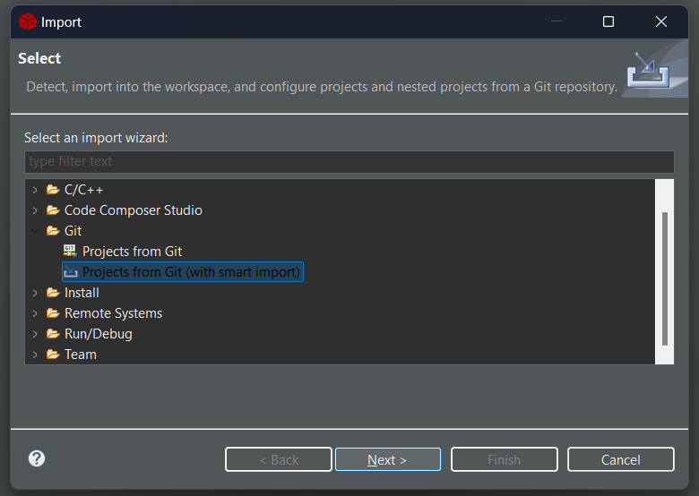
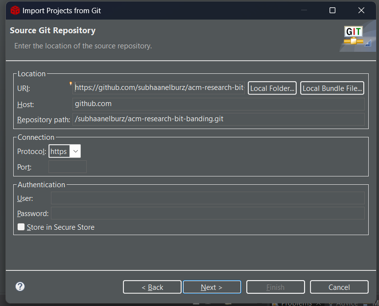
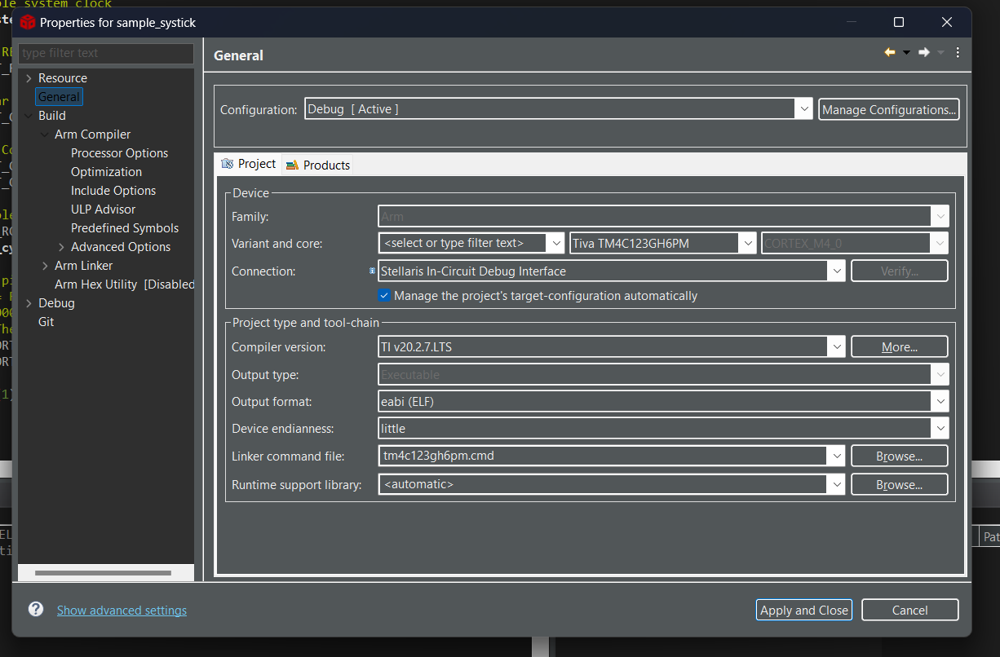

# CCS PROJECT IMPORT

## 1. Importing the Projects from GitHub

We will use the built-in Git integration in CCS to clone and import the project.

**Step 1:** In CCS, go to **`File -> Import...`**.

**Step 2:** In the import wizard, select **`Git -> Projects from Git (with smart import)`** and click **Next**.

**Step 3:** Select **`Clone URI`**. The repository URL should already be filled in if you've copied it. If not, paste it in.

* **URI:** `https://github.com/subhaanelburz/acm-research-bit-banding.git`

**Step 4:** Continue clicking **`Next`**. When prompted, choose a directory on your computer to save the local copy of this repository.

**Step 5:** Click **`Finish`**. CCS will now automatically import the projects from the repository into your workspace.

---

## 2. IMPORTANT: Fix Project Properties After Importing

For some reason, CCS does not always save the project-specific compiler and library settings when cloning from Git. You will need to fix this manually after importing.

**Step 1:** In the "Project Explorer", right-click on the project name (e.g., `rmw_baseline_test`).

**Step 2:** Go to **`Properties`**.

**Step 3:** Adjust the settings to match the screenshot below

---

## 3. How to Get Updates (`git pull`)

Whenever I push new code or updates, you will need to "pull" those changes into your local repository.

You can do this directly in CCS:

1. Right click the acm-research-bit-banding folder in the Project Explorer
2. Hover over Team
3. Select **`Pull`**.

This will update all the files in your project with the latest versions.
